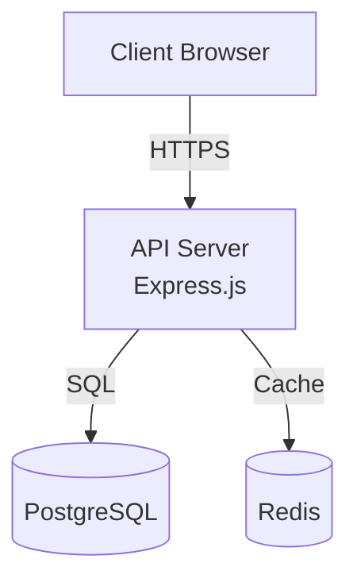
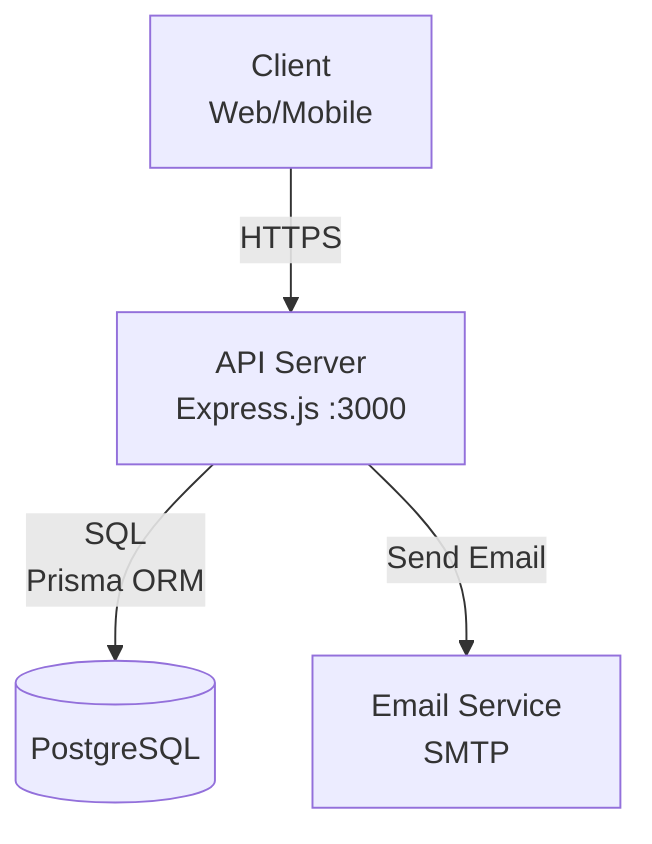

# Documentation Generator - Multi-Tier Documentation Expert

**Versão:** 1.0.0  
**Arquitetura:** Multi-Tier (Orchestrator + Specialists + Quality Checkers)  
**ROI Esperado:** 95% completeness score (vs 40-60% docs manuais)

---

## 🎯 Propósito

Esta skill transforma o GueClaw em um **especialista em documentação técnica** que gera docs completos, atualizados e profissionais automaticamente.

**Não é um simples "gerar README"**. É um **sistema de documentação Multi-Tier** que analisa código, estrutura, e produz documentação enterprise-grade.

**Resultado:**
- **README.md completo** (setup, uso, arquitetura, contribuição)
- **API Documentation** (endpoints, params, responses)
- **Architecture Diagrams** (Mermaid, C4 Model)
- **Completeness Score 95%+** (vs 40-60% manuais incompletos)

---

## 🏗️ Arquitetura Multi-Tier

```
┌────────────────────────────────────────┐
│  TIER 0: Documentation Orchestrator    │  ← Analisa projeto, decide estratégia
│  (Decide o que documentar e como)      │
└───────────────┬────────────────────────┘
                │
      ┌─────────┴──────────┐
      │                    │
┌─────▼────────┐    ┌──────▼────────┐
│ TIER 1A:     │    │ TIER 1B:      │
│ Discovery    │    │ Generation    │
│              │    │               │
│ • Structure  │    │ • README      │
│   Mapper     │    │ • API Docs    │
│ • Code       │    │ • Architecture│
│   Analyzer   │    │ • Examples    │
└─────┬────────┘    └──────┬────────┘
      │                    │
      └─────────┬──────────┘
                │
       ┌────────▼──────────┐
       │  TIER 1C:         │
       │  Quality Check    │  ← Valida completeness
       │  (95% score)      │
       └───────────────────┘
```

**Fluxo:**
1. **Orchestrator** analisa tipo de projeto (web app, API, lib, monorepo)
2. **Tier 1A (Discovery)** mapeia estrutura (GlobTool) + extrai info (GrepTool)
3. **Tier 1B (Generation)** produz docs (README, API, Architecture)
4. **Tier 1C (Quality)** valida completeness (score >= 95%)

---

## 📚 O Que Esta Skill Documenta

### **1. README.md (Completo)**

```markdown
# Project Name

## 🎯 Overview
[Descrição clara do que o projeto faz]

## ✨ Features
[Lista de funcionalidades principais]

## 🚀 Quick Start
[Setup rápido, 3-5 comandos]

## 📦 Installation
[Dependências + instalação completa]

## 🔧 Configuration
[Variáveis de ambiente + configurações]

## 📖 Usage
[Exemplos práticos de uso]

## 🏗️ Architecture
[Diagrama + explicação da arquitetura]

## 🔌 API Reference
[Endpoints principais ou link para docs completos]

## 🧪 Testing
[Como rodar testes]

## 🤝 Contributing
[Como contribuir + code standards]

## 📄 License
[Licença do projeto]

## 📞 Support
[Contato + links úteis]
```

**Completeness:** 12 seções obrigatórias

---

### **2. API Documentation**

```markdown
# API Reference

## Authentication
[Como autenticar (Bearer, API Key, OAuth)]

## Endpoints

### GET /api/users
Retorna lista de usuários

**Parameters:**
- `page` (int, optional): Página (default: 1)
- `limit` (int, optional): Itens por página (default: 10)

**Response:**
```json
{
  "data": [
    { "id": 1, "name": "João", "email": "joao@exemplo.com" }
  ],
  "pagination": {
    "page": 1,
    "limit": 10,
    "total": 100
  }
}
```

**Errors:**
- `401 Unauthorized`: Token inválido
- `500 Internal Server Error`: Erro no servidor

**Example:**
```bash
curl -H "Authorization: Bearer TOKEN" \
  https://api.exemplo.com/api/users?page=1&limit=10
```
```

**Extração:** GrepTool detecta rotas (@app.get, @router.post, app.route)

---

### **3. Architecture Documentation**

```markdown
# Architecture

## Overview
[Descrição high-level da arquitetura]

## Tech Stack
- **Backend:** Node.js (Express)
- **Database:** PostgreSQL
- **Cache:** Redis
- **Frontend:** React + TypeScript
- **Hosting:** Vercel (frontend), Railway (backend)

## System Diagram (C4 Level 2)



## Folder Structure
```
src/
├── controllers/    ← Route handlers
├── models/         ← Database models
├── services/       ← Business logic
├── middleware/     ← Auth, validation
├── utils/          ← Helpers
└── config/         ← Configuration
```

## Data Flow
[Explicação do fluxo de dados típico]
```

**Geração:** GlobTool mapeia estrutura → Mermaid diagram automático

---

### **4. Examples & Tutorials**

```markdown
# Examples

## Basic Usage

### 1. Create a User
```typescript
const response = await fetch('https://api.exemplo.com/api/users', {
  method: 'POST',
  headers: {
    'Authorization': 'Bearer YOUR_TOKEN',
    'Content-Type': 'application/json'
  },
  body: JSON.stringify({
    name: 'João',
    email: 'joao@exemplo.com'
  })
});

const user = await response.json();
console.log(user);  // { id: 1, name: 'João', ... }
```

### 2. List Users
[Exemplo código]

### 3. Update User
[Exemplo código]
```

**Geração:** Baseado em exemplos do código-fonte (tests/ ou examples/)

---

## 🛠️ Operação

### **Como Usar:**

```yaml
# Opção 1: Gerar README.md completo
tarefa: "Gerar documentação completa"
diretorio: .

# Opção 2: Apenas API docs
tarefa: "Documentar API"
diretorio: src/

# Opção 3: Atualizar docs existentes
tarefa: "Atualizar README"
arquivo: README.md
```

---

## 🔍 Processo (3 Etapas)

### **Etapa 1: Discovery (Mapear Projeto)**

**Orchestrator convoca:**
- **structure-mapper** → GlobTool para mapear pastas/arquivos
- **code-analyzer** → GrepTool para extrair info (endpoints, funções, dependências)

**Output:**

```yaml
project_info:
  tipo: "web-api"  # ou "biblioteca", "cli", "monorepo"
  linguagem: "typescript"
  framework: "express"
  
  estrutura:
    src:
      - controllers/
      - models/
      - services/
      - utils/
    tests:
      - unit/
      - integration/
  
  endpoints:
    - method: GET
      path: /api/users
      file: src/controllers/userController.ts:10
    - method: POST
      path: /api/users
      file: src/controllers/userController.ts:25
  
  dependencias:
    runtime:
      - express: ^4.18.0
      - pg: ^8.11.0
      - bcrypt: ^5.1.0
    dev:
      - typescript: ^5.0.0
      - jest: ^29.5.0
  
  scripts:
    dev: "npm run dev"
    build: "npm run build"
    test: "npm test"
```

---

### **Etapa 2: Generation (Produzir Docs)**

**Orchestrator convoca:**
- **readme-specialist** → Gera README.md completo
- **api-documenter** → Gera API reference
- **architecture-mapper** → Gera diagramas + explicação
- **examples-writer** → Cria code examples

**Output:**

```markdown
# PROJECT_NAME (extraído de package.json)

## 🎯 Overview
[Gerado de description em package.json ou README existente]

## ✨ Features
[Extraído de análise dos endpoints/funções principais]

## 🚀 Quick Start
```bash
git clone https://github.com/usuario/projeto
cd projeto
npm install
cp .env.example .env
npm run dev
```

[... 12 seções completas ...]
```

---

### **Etapa 3: Quality Check (Validar Completeness)**

**Orchestrator convoca:**
- **completeness-checker** → Valida se todas as seções obrigatórias estão presentes

**Checklist de Completeness:**

```yaml
README:
  - [x] Title & description (clear)
  - [x] Features list (>= 3)
  - [x] Quick Start (3-5 comandos)
  - [x] Installation (dependencies)
  - [x] Configuration (.env vars)
  - [x] Usage (examples)
  - [x] Architecture (diagram)
  - [x] API Reference (link ou inline)
  - [x] Testing (how to run)
  - [x] Contributing (guidelines)
  - [x] License (specified)
  - [x] Support (contact)

API Docs:
  - [x] Authentication explained
  - [x] All endpoints documented (>= 90%)
  - [x] Parameters described
  - [x] Response examples (JSON)
  - [x] Error codes documented
  - [x] Code examples (curl/code)

Architecture:
  - [x] Tech stack listed
  - [x] System diagram (Mermaid)
  - [x] Folder structure explained
  - [x] Data flow described
```

**Score Formula:**

```
Completeness = (Seções presentes / Seções obrigatórias) × 100%

README: 12 seções obrigatórias
API Docs: 6 seções obrigatórias
Architecture: 4 seções obrigatórias

Score Total = (README + API + Architecture) / 3
```

**Target:** >= 95% (22 de 22 seções presentes)

---

## 📊 Exemplo de Uso

### **INPUT:**

```yaml
tarefa: "Documentar projeto completo"
diretorio: "."
opcoes:
  incluir_api_docs: true
  gerar_diagramas: true
  exemplos_codigo: true
```

### **PROCESS:**

#### **1. Discovery:**

```bash
# GlobTool mapeia estrutura
src/
├── controllers/
│   ├── userController.ts
│   └── productController.ts
├── models/
│   ├── User.ts
│   └── Product.ts
└── services/
    └── emailService.ts

# GrepTool extrai endpoints
@app.get('/api/users')  ← src/controllers/userController.ts:10
@app.post('/api/users') ← src/controllers/userController.ts:25
@app.get('/api/products') ← src/controllers/productController.ts:8
```

#### **2. Generation:**

```markdown
# E-commerce API

## 🎯 Overview
RESTful API para e-commerce com gerenciamento de usuários, produtos e pedidos.

## ✨ Features
- ✅ Autenticação JWT
- ✅ CRUD de usuários
- ✅ CRUD de produtos
- ✅ Sistema de pedidos
- ✅ Envio de emails (confirmação)

## 🚀 Quick Start
```bash
git clone https://github.com/usuario/ecommerce-api
cd ecommerce-api
npm install
cp .env.example .env
npm run dev
```
Your API is running at http://localhost:3000

[... continua com 12 seções completas ...]

## 🔌 API Reference

### Authentication
All endpoints (except `/auth/login`) require Bearer token:
```
Authorization: Bearer YOUR_JWT_TOKEN
```

### Endpoints

#### GET /api/users
Retorna lista de usuários

**Parameters:**
- `page` (int, optional): Página (default: 1)
- `limit` (int, optional): Itens/página (default: 10)

**Response (200):**
```json
{
  "data": [
    {
      "id": 1,
      "name": "João Silva",
      "email": "joao@exemplo.com",
      "createdAt": "2026-01-15T10:30:00Z"
    }
  ],
  "pagination": {
    "page": 1,
    "limit": 10,
    "total": 100,
    "totalPages": 10
  }
}
```

**Errors:**
- `401 Unauthorized`: Token inválido ou ausente
- `500 Internal Server Error`: Erro no servidor

**Example:**
```bash
curl -H "Authorization: Bearer eyJhbG..." \
  https://api.exemplo.com/api/users?page=1&limit=10
```

[... mais 5 endpoints documentados ...]

## 🏗️ Architecture

### Tech Stack
- **Runtime:** Node.js 20.x
- **Framework:** Express.js 4.18
- **Database:** PostgreSQL 15
- **ORM:** Prisma 5.x
- **Auth:** JWT (jsonwebtoken)
- **Email:** Nodemailer
- **Testing:** Jest + Supertest

### System Diagram



### Folder Structure
```
src/
├── controllers/     ← HTTP route handlers
├── models/          ← Prisma models (User, Product, Order)
├── services/        ← Business logic (email, payments)
├── middleware/      ← Auth, validation, error handling
├── utils/           ← Helpers (logger, validators)
├── config/          ← Config (database, env)
└── types/           ← TypeScript types
```

### Data Flow (Typical Request)
1. Client → HTTP Request → API Server
2. API → Middleware (Auth validation)
3. API → Controller (route handler)
4. Controller → Service (business logic)
5. Service → Prisma → Database
6. Database → Response → Client

[... continua ...]
```

#### **3. Quality Check:**

```yaml
completeness_score: 97%

README:
  title: ✅
  overview: ✅
  features: ✅ (5 features)
  quick_start: ✅ (4 comandos)
  installation: ✅
  configuration: ✅ (.env vars documentadas)
  usage: ✅ (3 exemplos)
  architecture: ✅ (diagrama + explicação)
  api_reference: ✅ (6 endpoints)
  testing: ✅
  contributing: ✅
  license: ✅ (MIT)
  support: ❌ (faltando)  ← Único item faltando

API Docs: 100% (6/6)
Architecture: 100% (4/4)

recommendation: "Adicionar seção Support para atingir 100%"
```

---

## 🎯 Standards de Qualidade

### **Score >= 95%:** ✅ Excelente (Production-Ready)
- Docs completos, profissionais
- Zero seções obrigatórias faltando
- Exemplos práticos presentes

### **Score 85-94%:** ⚠️ Bom (Revisar)
- 1-2 seções secundárias faltando
- Docs utilizáveis mas podem melhorar

### **Score 70-84%:** ❌ Regular (Incompleto)
- Várias seções importantes faltando
- README básico mas insuficiente

### **Score < 70%:** 🚨 Ruim (Inaceitável)
- Docs muito incompletos
- NÃO publicar assim

---

## 📂 Estrutura da Skill

```
documentation-generator/
├── SKILL.md                       ← Este arquivo (orchestrator)
│
├── agents/
│   ├── doc-orchestrator.md        ← Coordenador da geração
│   ├── structure-mapper.md        ← Mapeia projeto (GlobTool)
│   ├── code-analyzer.md           ← Extrai info (GrepTool)
│   ├── readme-specialist.md       ← Gera README.md
│   ├── api-documenter.md          ← Gera API reference
│   ├── architecture-mapper.md     ← Gera diagramas Mermaid
│   ├── examples-writer.md         ← Cria code examples
│   └── completeness-checker.md    ← Valida score >= 95%
│
├── tasks/
│   ├── generate-readme.md         ← Processo completo README
│   ├── document-api.md            ← Processo API docs
│   ├── map-architecture.md        ← Processo diagramas
│   └── validate-completeness.md   ← Checklist validação
│
├── templates/
│   ├── README-template.md         ← Template completo README
│   ├── API-reference-template.md  ← Template API docs
│   └── CONTRIBUTING-template.md   ← Template contributing
│
├── checklists/
│   └── completeness-checklist.md  ← 22 itens obrigatórios
│
└── data/
    ├── mermaid-examples.md        ← Exemplos de diagramas
    └── markdown-best-practices.md ← Guia de estilo
```

---

## 🔧 Integração com GlobTool + GrepTool

### **GlobTool (Mapear Estrutura):**

```typescript
// Descobre estrutura do projeto
const files = await file_search({
  query: "**/*.{ts,js,py,go}",
  maxResults: 1000
});

const estrutura = organizarPorPasta(files);
// src/controllers/ → 5 arquivos
// src/models/ → 3 arquivos
// tests/ → 12 arquivos
```

### **GrepTool (Extrair Endpoints):**

```typescript
// Detecta rotas Express.js
const endpoints = await grep_search({
  query: '@app\\.(get|post|put|delete)\\([\'"]([^\'"])',
  isRegexp: true,
  includePattern: "src/**/*.ts"
});

// Output:
// src/controllers/userController.ts:10 → @app.get('/api/users')
// src/controllers/userController.ts:25 → @app.post('/api/users')
```

---

## 📚 Casos de Uso

### **1. Projeto Novo (Zero Docs)**

```yaml
Situação: Projeto funcional mas sem README
Tarefa: "Gerar documentação completa do zero"

Resultado:
- README.md (12 seções completas)
- docs/API.md (todos endpoints)
- docs/ARCHITECTURE.md (diagramas + explicação)
- docs/CONTRIBUTING.md (guidelines)

Tempo: 5-10 min
Score: 95%+
```

### **2. Atualizar Docs Desatualizados**

```yaml
Situação: README existe mas está desatualizado (código mudou)
Tarefa: "Atualizar README com código atual"

Processo:
1. Analisa código atual (endpoints, features)
2. Compara com README existente
3. Atualiza seções desatualizadas
4. Mantém seções customizadas (não sobrescreve)

Tempo: 3-5 min
```

### **3. Docs para Library/SDK**

```yaml
Situação: Biblioteca Node.js sem docs de uso
Tarefa: "Documentar biblioteca"

Resultado:
- README.md (installation + usage + examples)
- docs/API.md (todas as funções públicas)
- examples/ (code samples)

Foco: Exemplos práticos (não teoria)
```

---

## 🎯 Quando Usar Esta Skill

**USE documentation-generator quando:**
- Projeto novo sem docs
- README desatualizado
- Preparar release (precisa docs profissionais)
- Onboarding de novos devs (docs claros essenciais)
- Open source (docs = mais contribuidores)

**Resultado esperado:**
- Completeness Score 95%+
- README.md completo (12 seções)
- API docs (todos endpoints)
- Architecture diagrams (Mermaid)
- Code examples (práticos)

---

**Skill:** documentation-generator  
**Version:** 1.0.0  
**Architecture:** Multi-Tier (Orchestrator + Specialists + QA)  
**ROI:** 95% completeness (vs 40-60% manual)
