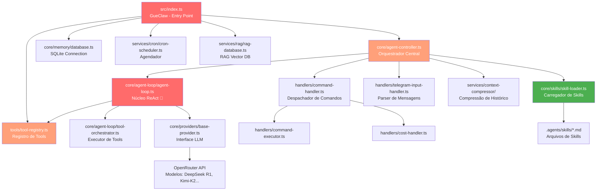

# 🗺️ Mapa Arquitetural do Projeto

> Gerado por análise de acoplamento — GueClaw v2.x | 142 arquivos TypeScript | ~14.295 LOC

---

## 🔗 Grafo de Dependências Principais

---

## 🏗️ Ligações Importantes (Core Domain & Alto Acoplamento)

*Arquivos centrais para o funcionamento da aplicação.*

### ✅ Arquivos Úteis

- `src/index.ts` → **Dependências:** agent-controller, tool-registry, database, 30+ tools, cron-scheduler, rag-database — **Motivo:** Entry point principal da classe GueClaw; inicializa toda a aplicação e registra todas as ferramentas no ToolRegistry

- `src/core/agent-controller.ts` → **Dependências:** agent-loop, command-handler, skill-loader, telegram-input-handler, context-compressor, error-recovery-manager — **Motivo:** Orquestrador central — recebe mensagem do Telegram, decide se é comando ou prompt, encaminha para AgentLoop ou CommandHandler

- `src/core/agent-loop/agent-loop.ts` → **Dependências:** tool-registry, tool-orchestrator, base-provider, agent-state, task-tracker, trace-repository, tool-permissions — **Motivo:** Núcleo do agente ReAct (870 linhas); implementa o loop de raciocínio iterativo — o sistema para sem ele. Importado por 6 módulos

- `src/tools/tool-registry.ts` → **Dependências:** base-tool (interface) — **Motivo:** Singleton Map de todas as tools disponíveis; o AgentLoop consulta getAllDefinitions() para construir o schema enviado ao LLM. Importado por 6+ módulos

- `src/core/skills/skill-loader.ts` → **Dependências:** fs, path, js-yaml — **Motivo:** Lê e parseia os arquivos `.agents/skills/*.md`; injeta skills no system prompt do agente. Crítico para o sistema de skills funcionar

- `src/core/agent-loop/tool-orchestrator.ts` → **Dependências:** tool-registry, base-tool — **Motivo:** Executa as tool calls retornadas pelo LLM com garantia de execução (DVACE Phase 3); contém o fix de double-encoded JSON do DeepSeek R1

- `src/handlers/command-handler.ts` → **Dependências:** telegram-output-handler, command-executor, cost-handler, mcp-handler, memory-handler — **Motivo:** Despachador de comandos Telegram (/limpar, /status, /custo etc.); único ponto de entrada para comandos slash

- `src/core/memory/database.ts` → **Dependências:** better-sqlite3 — **Motivo:** Conexão SQLite compartilhada por todos os repositórios de memória; sistema cai sem ela

### ⚠️ Arquivos Inúteis (Revisão Necessária)

- `src/services/llm-router/cot-triage.ts` → **Motivo:** Feature de roteamento inteligente de modelos (CoT Triage) implementada mas **nunca integrada** — nenhum arquivo chama `CotTriage.classify()`. AgentController chama AgentLoop diretamente sem triagem. Feature completa mas dead code funcional

- `src/services/mcp/mcp-manager.ts` → **Motivo:** Duplicata — existe `src/tools/mcp-manager.ts` que é o arquivo realmente usado (importado por mcp-tool.ts). Este em services/mcp/ não é importado por ninguém

---

## 🧩 Ligações Não Importantes (Periféricos & Baixo AcopFAÇAlamento)

*Arquivos isolados que não afetam diretamente o core.*

### ✅ Arquivos Úteis

- `src/services/heartbeat.ts` → **Uso:** Monitor de saúde do serviço; envia ping periódico via Telegram se o agente ficar offline. Inicializado em index.ts mas não afeta o fluxo principal

- `src/services/security-monitor.ts` → **Uso:** Monitora tentativas de acesso SSH não autorizado ao VPS; alerta via Telegram. Periférico de segurança

- `src/utils/telegram-formatter.ts` → **Uso:** Formata mensagens Markdown para o Telegram (escape de caracteres especiais). Utilitário puro sem estado

- `src/services/cost-tracker/` (4 arquivos) → **Uso:** Rastreia tokens consumidos e custo estimado por sessão. Periférico de observabilidade

- `src/mcp/memory-server.ts` → **Uso:** Servidor MCP que expõe memórias do agente como resource para outros clientes MCP. Extensão opcional

- `src/services/context-compressor/` (4 arquivos) → **Uso:** Comprime o histórico de conversa quando ultrapassa limite de tokens. Suporte ao AgentLoop mas não é crítico para funcionamento básico

- `.agents/skills/*.md` (50+ arquivos) → **Uso:** Skills do agente (mapa-projeto, vps-manager, skill-creator, etc). Lidos pelo skill-loader e injetados no system prompt

- `dashboard/` (Next.js app) → **Uso:** Painel web que consome a Debug API na porta 3742; permite monitorar logs, sessões, cron jobs e conversa ao vivo

### 🗑️ Arquivos Inúteis (Candidatos a Exclusão)

- `src/tools/BUILDTOOL-COMPARISON.ts` → **Motivo:** Arquivo 100% didático comparando "jeito antigo vs novo" de criar tools. Não é importado por nenhum arquivo, nunca será executado. Pertence à documentação, não ao código

- `src/scripts/error-log-mapper.ts` → **Motivo:** Script standalone sem exportações; não é importado por nenhum módulo. Potencialmente útil como utilitário de debug pontual mas não pertence ao src/

- `dashboard/src/app/chat-improved/page.tsx` + `dashboard/src/app/chat/page-improved.tsx` → **Motivo:** Dois arquivos de "versão melhorada" do chat que coexistem com `dashboard/src/app/chat/page.tsx`. Confusão de naming; provavelmente rascunhos não finalizados

- `dashboard/src/app/editor/page.tsx` → **Motivo:** Página de editor de arquivos sem backend funcional correspondente (a rota de API `/api/files` é simples demais para suportar um editor real). Possivelmente stub não finalizado

---

## 📊 Resumo Executivo

| Métrica | Valor |
|---|---|
| Total de arquivos TypeScript | 142 |
| LOC total estimado | ~14.295 |
| Arquivos de Core Domain (críticos) | 8 |
| Arquivos periféricos úteis | ~120 |
| Órfãos confirmados | 2 (BUILDTOOL-COMPARISON, error-log-mapper) |
| Duplicatas | 1 (services/mcp/mcp-manager) |
| Features não integradas | 1 (CoT Triage Router — pronto mas desligado) |
| Rascunhos no dashboard | 3 arquivos |

---

## 🔥 Ações Recomendadas

**Remoção imediata (sem risco):**
1. `src/tools/BUILDTOOL-COMPARISON.ts` — delete
2. `src/services/mcp/mcp-manager.ts` — delete (usar o de `src/tools/`)

**Integrar ou remover:**
3. `src/services/llm-router/cot-triage.ts` — integrar no `agent-controller.ts` antes de chamar AgentLoop, ou remover

**Limpeza do dashboard:**
4. Decidir entre `chat/page.tsx` e `chat-improved/page.tsx` — manter um, deletar outro
5. Avaliar se `editor/page.tsx` tem futuro ou é rascunho

---

*Mapa gerado automaticamente por análise de acoplamento — Skill: mapa-projeto v1.0.0*
