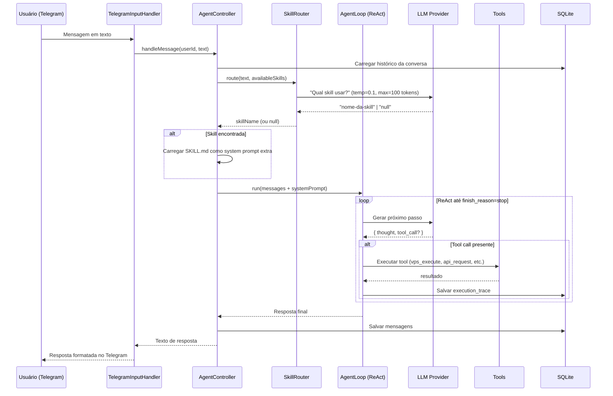

# MASTER — Contexto Completo do Projeto GueClaw

> **Para humanos e agentes de IA:** Este é o documento de entrada da "rede neural" do projeto.
> Leia este arquivo primeiro. Ele mapeia tudo que existe, como as partes se conectam, e onde encontrar detalhes.
> Última atualização: 2026-03-23

---

## 1. O que é o GueClaw?

O **GueClaw** é um agente de IA pessoal operado via **Telegram**, rodando em uma **VPS Linux** com **PM2**. Ele:

- Recebe mensagens em linguagem natural
- Usa um **LLM** (Claude, GPT-4o ou Copilot) para entender a intenção
- Invoca uma **skill especializada** (`.agents/skills/`) para executar a ação
- Retorna a resposta no Telegram

### Diferencial
Não é um chatbot genérico. É um **sistema de agentes extensível**: novas skills podem ser criadas, enviadas a um vault compartilhado (`meu-vault-obsidian`) e distribuídas para outros projetos automaticamente via GitHub Actions.

### Dono e Contexto
- **Usuário:** Moises — desenvolvedor/sysadmin avançado
- **Timezone:** America/Sao_Paulo (UTC-3)
- **Tom esperado:** Direto, técnico, sem rodeios. Não pergunta "posso continuar?" — executa e reporta.
- **Idioma padrão:** Português (Brasil)

---

## 2. Mapa do Repositório

```
gueclaw/
├── src/                          ← Código TypeScript do bot
│   ├── index.ts                  ← Entry point
│   ├── core/
│   │   ├── agent-loop/           ← ReAct loop (Thought-Action-Observation)
│   │   ├── memory/               ← SQLite: conversas, mensagens, traces
│   │   ├── providers/            ← LLM providers (Copilot, DeepSeek)
│   │   └── skills/               ← SkillLoader + SkillRouter + SkillExecutor
│   ├── handlers/                 ← Input/Output Telegram
│   ├── services/                 ← Heartbeat, notificações
│   ├── tools/                    ← Tools disponíveis ao LLM
│   ├── types/                    ← Tipos TypeScript compartilhados
│   └── utils/                    ← Formatação, identidade
│
├── .agents/
│   ├── SOUL.md                   ← Identidade e personalidade do GueClaw
│   ├── USER.md                   ← Perfil e preferências do usuário
│   ├── skills/                   ← 18 skills (instruções em SKILL.md)
│   └── agents/                   ← 133+ personas especializadas (Markdown)
│
├── docs/                         ← Documentação técnica
│   ├── MASTER.md                 ← ESTE ARQUIVO
│   ├── index.md                  ← Visão geral + diagrama
│   ├── architecture/             ← C4, skill routing, schema, providers
│   ├── agents/                   ← Model Cards
│   └── operations/               ← Runbook, VPS history
│
├── specs/                        ← Especificações originais do sistema
├── DOE/                          ← Framework DOE (Directives/Orchestration/Execution)
├── scripts/                      ← Ferramentas de deploy, auth, debug
└── tests/                        ← unit/ e e2e/
```

---

## 3. Como o Bot Funciona (Fluxo Completo)



### Pontos-chave do fluxo

1. **SkillRouter usa LLM próprio** (temperatura baixa 0.1) para classificar — não é regex nem word-match
2. **SKILL.md é injetado como system prompt adicional** — o LLM "lê as instruções" da skill antes de responder
3. **ReAct loop**: o LLM pensa → chama tool → observa resultado → repete até resolver
4. **Fallback**: se nenhuma skill for identificada, o bot responde com o LLM em modo chat geral
5. **Falha de routing** (erro de provider) → fallback automático para chat geral, nunca quebra

---

## 4. Identidade do Agente

### SOUL (`.agents/SOUL.md`)
```
Nome:          GueClaw
Especialidade: DevOps + administração de sistemas
Tom:           Profissional mas próximo (colega sênior, não robô corporativo)
Idioma:        Português (Brasil) por padrão
Regras:        Nunca inventa resultados. Se falhou, diz que falhou com o erro real.
               Proativo: detecta problemas e avisa sem esperar ser perguntado.
```

### USER (`.agents/USER.md`)
```
Nome:          Moises
Nível:         Avançado (Docker, Linux, git — sem explicações básicas)
Preferência:   Respostas curtas. Jargão técnico OK. "O que foi feito", não "o que vai ser feito".
Timezone:      America/Sao_Paulo (UTC-3)
Projetos:      GueClaw, FluxoHub, clientes de BI
```

---

## 5. Skills — Catálogo Completo

Skills são diretórios em `.agents/skills/<nome>/SKILL.md`. A `description` no frontmatter do SKILL.md é usada pelo SkillRouter para matching.

| Skill | Domínio | APIs usadas |
|---|---|---|
| `google-calendar-daily` | Agenda diária (resumo 7h) | Google Calendar OAuth2 |
| `google-calendar-events` | Criar/editar eventos | Google Calendar OAuth2 |
| `obsidian-notes` | Notas no vault Obsidian | GitHub API (git) |
| `uazapi-whatsapp` | Enviar mensagens WhatsApp | UazAPI REST |
| `uazapi-scheduler` | Agendar mensagens WhatsApp | UazAPI REST |
| `uazapi-groups` | Listar grupos WhatsApp | UazAPI REST |
| `whatsapp-leads-sender` | Campanha automática (CSV → SQLite → envio) | UazAPI REST |
| `vps-manager` | Administração VPS (Docker, PM2, nginx) | vps_execute_command |
| `project-docs` | Documentação (C4, ADR, Model Card, Mermaid) | file_operations |
| `doe` | Engenharia de software (Clean Arch + DDD) | file_operations, vps_execute |
| `self-improvement` | Criar/modificar skills | file_operations, git |
| `skill-creator` | Criar/avaliar/iterar skills | file_operations |
| `skill-security-analyzer` | Auditoria de segurança de skills | file_operations |
| `subagent-creator` | Criar personas de subagentes | file_operations |
| `liquidacao-sentenca` | Direito processual civil (CPC/2015) | nenhuma |
| `matematica-financeira` | Cálculos financeiros (SAC, Price, VPL) | nenhuma |
| `rag-curriculos` | Ranquear currículos por vaga | file_operations |
| `frontend-design` | UI/Frontend production-grade | file_operations |

### Como criar uma nova skill

```
1. Criar diretório:  .agents/skills/<nome>/
2. Criar SKILL.md com frontmatter name + description obrigatórios
3. (Opcional) criar scripts/ com código de apoio
4. Persistir:
   git add .agents/skills/<nome>/
   git commit -m "feat(<nome>): descrição"
   git push origin main
   bash scripts/sync-skills.sh push "feat(<nome>): descrição"
5. Na VPS:
   bash scripts/sync-skills.sh pull
   pm2 restart gueclaw
```

---

## 6. Agentes Especializados (Vault)

São **133 personas** em Markdown em `.agents/agents/`, organizadas em 10 categorias. Não são executáveis diretamente — o GueClaw **lê o Markdown do agente** e adota aquela persona para a tarefa.

```bash
# Como invocar na VPS:
cat /opt/obsidian-vault/GueClaw/skills/myagents/<categoria>/<nome>.md
```

| Categoria | Qtd | Exemplos |
|---|---|---|
| `01-core-development` | 11 | backend-developer, frontend-developer, api-designer |
| `02-language-specialists` | 27 | python-pro, typescript-pro, react-specialist, rust-engineer |
| `03-infrastructure` | 16 | devops-engineer, docker-expert, kubernetes-specialist |
| `04-quality-security` | 14 | qa-expert, security-auditor, penetration-tester |
| `05-data-ai` | 13 | data-scientist, llm-architect, prompt-engineer |
| `06-developer-experience` | 14 | documentation-engineer, git-workflow-manager |
| `07-specialized-domains` | 13 | fintech-engineer, risk-manager, quant-analyst |
| `08-business-product` | 11 | product-manager, business-analyst, technical-writer |
| `09-meta-orchestration` | 10 | doe-orchestrator, multi-agent-coordinator |
| `10-research-analysis` | 7 | market-researcher, competitive-analyst |

---

## 7. LLM Providers

O código real em `src/core/providers/provider-factory.ts` implementa esta lógica de prioridade:

```
Prioridade de seleção automática (getProvider sem argumento):
  1. GitHub Copilot (OAuth) → se GITHUB_COPILOT_USE_OAUTH=true
  2. GitHub Copilot (API Key) → se GITHUB_COPILOT_API_KEY ou OPENAI_API_KEY
  3. DeepSeek Fast → se DEEPSEEK_API_KEY
  (fallback para o primeiro disponível)

Para routing (SkillRouter): usa getFastProvider() — sempre o mais rápido/barato disponível
```

| Provider | Env var principal | Modelo padrão | Uso ideal |
|---|---|---|---|
| Copilot OAuth | `GITHUB_COPILOT_USE_OAUTH=true` | `claude-sonnet-4.5` | Uso principal (Copilot Pro) |
| Copilot API Key | `GITHUB_COPILOT_API_KEY` | `gpt-4o` | Alt. com API Key OpenAI/GitHub |
| DeepSeek Fast | `DEEPSEEK_API_KEY` | `deepseek-chat` | Routing + respostas rápidas |
| DeepSeek Reasoner | `DEEPSEEK_API_KEY` | `deepseek-reasoner` | Raciocínio estendido (código) |

> **Fallback automático:** se o provider solicitado não existe, usa o primeiro disponível. Nunca lança exceção em runtime por provider ausente.

---

## 8. Banco de Dados (SQLite)

**Arquivo:** `./data/gueclaw.db` (ou `DATABASE_PATH` no `.env`)
**Mode:** WAL (Write-Ahead Logging) se `ENABLE_WAL=true`

### Schema Real (extraído de `src/core/memory/database.ts`)

```sql
-- Conversas por usuário
CREATE TABLE conversations (
  id         TEXT PRIMARY KEY,
  user_id    TEXT NOT NULL,
  provider   TEXT NOT NULL,
  created_at INTEGER DEFAULT (strftime('%s', 'now')),
  updated_at INTEGER DEFAULT (strftime('%s', 'now'))
);

-- Mensagens de cada conversa
CREATE TABLE messages (
  id              TEXT PRIMARY KEY,
  conversation_id TEXT NOT NULL,
  role            TEXT NOT NULL CHECK(role IN ('user','assistant','system','tool')),
  content         TEXT NOT NULL,
  timestamp       INTEGER DEFAULT (strftime('%s', 'now')),
  metadata        TEXT,
  FOREIGN KEY (conversation_id) REFERENCES conversations(id) ON DELETE CASCADE
);

-- Histórico de execução de skills (analytics)
CREATE TABLE skill_executions (
  id               TEXT PRIMARY KEY,
  skill_name       TEXT NOT NULL,
  user_id          TEXT NOT NULL,
  success          INTEGER NOT NULL,     -- 0 ou 1
  error_message    TEXT,
  execution_time_ms INTEGER,
  timestamp        INTEGER DEFAULT (strftime('%s', 'now'))
);

-- Traces de debug (Debug API :3742)
CREATE TABLE execution_traces (
  id              TEXT PRIMARY KEY,
  conversation_id TEXT NOT NULL,
  message_id      TEXT,
  iteration       INTEGER NOT NULL,
  tool_name       TEXT,
  tool_args       TEXT,                  -- JSON
  tool_result     TEXT,                  -- JSON
  thought         TEXT,
  tokens_used     INTEGER,
  finish_reason   TEXT,
  created_at      INTEGER DEFAULT (strftime('%s', 'now'))
);

-- Índices
CREATE INDEX idx_messages_conversation  ON messages(conversation_id, timestamp);
CREATE INDEX idx_conversations_user     ON conversations(user_id, updated_at);
CREATE INDEX idx_skill_executions_user  ON skill_executions(user_id, timestamp);
CREATE INDEX idx_traces_conversation    ON execution_traces(conversation_id, created_at);
```

> **Banco de leads:** `.agents/skills/whatsapp-leads-sender/data/leads.db` — schema separado, gerenciado pela skill.

---

## 9. Tools Disponíveis ao LLM

Registradas em `src/tools/tool-registry.ts`:

| Tool | Descrição | Operações principais |
|---|---|---|
| `vps_execute_command` | Executa comandos shell | `command: string` |
| `docker` | Operações Docker | start/stop/logs/list |
| `file_operations` | Lê/escreve/cria/deleta arquivos | read/write/create/delete/list |
| `api_request` | Chamadas HTTP externas | GET/POST/PUT/DELETE |
| `audio` | TTS + STT | text-to-speech, speech-to-text |
| `analyze_image` | Análise de imagens | describe, OCR |
| `memory_write` | Escreve na memória SQLite | save key-value |
| `read_skill` | Carrega SKILL.md em runtime | name → content |

---

## 10. Sync de Skills (Vault ↔ Projetos)

### Arquitetura

```
meu-vault-obsidian (GitHub) ← fonte da verdade
  GueClaw/skills/myskills/   ← todas as skills
  GueClaw/skills/myagents/   ← todos os agents

gueclaw (GitHub)
  .agents/skills/             ← cópia sincronizada
  .agents/agents/             ← cópia sincronizada
```

### Comandos de sync

```bash
# Baixar skills do vault (vault → projeto)
bash scripts/sync-skills.sh pull

# Enviar skills para o vault (projeto → vault)
bash scripts/sync-skills.sh push "feat: descrição"

# Ver diferenças sem alterar nada
bash scripts/sync-skills.sh status
```

### GitHub Actions (automação)

- **`.github/workflows/sync-skills-from-vault.yml`** — gueclaw escuta `repository_dispatch: vault_skills_updated`
- Quando o vault empurra mudanças nas skills, este workflow faz `sync pull` e commita automaticamente
- **Pendente:** configurar `GUECLAW_TOKEN` secret em `meu-vault-obsidian > Settings > Secrets`

---

## 11. Deploy e Operações

### Stack em produção
```
VPS Ubuntu
  /opt/gueclaw-agent/   ← repositório gueclaw clonado
  /opt/obsidian-vault/  ← meu-vault-obsidian clonado
  PM2 (gueclaw)         ← gerencia o processo Node.js
```

### Deploy padrão (atualização)
```bash
cd /opt/gueclaw-agent
git pull origin main
npm install            # apenas se package.json mudou
npm run build          # compila TypeScript → dist/
pm2 restart gueclaw
pm2 logs gueclaw --lines 20
```

### Primeiro deploy (do zero)
```bash
# 1. Clonar repositório
git clone https://github.com/Moisesjr20/gueclaw.git /opt/gueclaw-agent
cd /opt/gueclaw-agent

# 2. Instalar dependências
npm install

# 3. Configurar ambiente
cp .env.example .env
nano .env   # preencher tokens

# 4. Build
npm run build

# 5. Configurar PM2
pm2 start dist/index.js --name gueclaw
pm2 save
pm2 startup   # habilitar autostart no boot

# 6. Configurar webhook Telegram
curl "https://api.telegram.org/bot{TOKEN}/setWebhook?url=https://{SEU_DOMINIO}/webhook"

# 7. Sincronizar skills do vault
bash scripts/sync-skills.sh pull
pm2 restart gueclaw
```

### Variáveis de ambiente obrigatórias

| Variável | Descrição | Exemplo |
|---|---|---|
| `TELEGRAM_BOT_TOKEN` | Token do bot | `123456:ABC...` |
| `TELEGRAM_ALLOWED_USER_IDS` | IDs permitidos (vírgula) | `123456789` |
| `DATABASE_PATH` | Caminho do banco SQLite | `./data/gueclaw.db` |

### Variáveis opcionais (por provider)

| Variável | Provider |
|---|---|
| `GITHUB_COPILOT_USE_OAUTH=true` | Copilot OAuth (recomendado) |
| `GITHUB_COPILOT_API_KEY` | Copilot via API Key |
| `DEEPSEEK_API_KEY` | DeepSeek |
| `GOOGLE_CLIENT_ID` + `GOOGLE_CLIENT_SECRET` | Google Calendar |
| `UAIZAPI_TOKEN` + `UAIZAPI_BASE_URL` | WhatsApp |
| `GITHUB_TOKEN` | Sync vault Obsidian |

---

## 12. Framework DOE

O projeto usa o framework **DOE (Directives → Orchestration → Execution)** para decisões de engenharia:

| Camada | Arquivo | Papel |
|---|---|---|
| Directive | `DOE/Directives.md` | O que fazer (regras, restrições, objetivos) |
| Orchestration | `DOE/Orchestration.md` | Como decidir (workflow: Análise → Plano → Aprovação → Execução) |
| Execution | `DOE/Executions.md` | Comandos preferidos (`npm run test:unit`, `lint:fix`, etc.) |

**Workflow obrigatório para qualquer implementação:**
1. Análise — ler todos os arquivos relacionados
2. Plano — gerar "Implementation Plan" e apresentar ao usuário
3. **Aguardar "DE ACORDO"** antes de executar
4. Execução — implementar o plano aprovado
5. Review — rodar testes e mostrar output

---

## 13. Mapa da Documentação (o que está onde)

| Quero entender... | Leia... |
|---|---|
| Visão geral rápida | [docs/index.md](index.md) |
| **Contexto completo** | **Este arquivo** |
| Arquitetura (quem → o quê) | [docs/architecture/c4-context.md](architecture/c4-context.md) |
| Arquitetura (como é composto) | [docs/architecture/c4-containers.md](architecture/c4-containers.md) |
| Como as skills são roteadas | [docs/architecture/skill-routing.md](architecture/skill-routing.md) |
| Schema do banco de dados | [docs/architecture/db-schema.md](architecture/db-schema.md) |
| Qual LLM usar / quando | [docs/architecture/providers.md](architecture/providers.md) |
| Por que SQLite foi escolhido | [docs/architecture/decisions/ADR-0001-usar-sqlite.md](architecture/decisions/ADR-0001-usar-sqlite.md) |
| Por que o sync funciona assim | [docs/architecture/decisions/ADR-0002-sync-skills-vault.md](architecture/decisions/ADR-0002-sync-skills-vault.md) |
| Capacidades completas do bot | [docs/agents/gueclaw-bot-model-card.md](agents/gueclaw-bot-model-card.md) |
| Como operar em produção | [docs/operations/runbook.md](operations/runbook.md) |
| Histórico de mudanças na VPS | [docs/operations/vps-history.md](operations/vps-history.md) |
| Requisitos do produto | [specs/PRD.md](../specs/PRD.md) |
| Spec do agent loop | [specs/agent-loop.md](../specs/agent-loop.md) |
| Spec de memória | [specs/memory.md](../specs/memory.md) |

---

## 14. Lacunas Conhecidas (Roadmap de Docs)

Status atualizado em 2026-03-23:

| # | Lacuna | Prioridade | Status |
|---|---|---|---|
| 1 | Completar runbook de primeiro deploy | Alta | ✅ Resolvido (seção 11 deste doc) |
| 2 | Schema SQLite documentado | Alta | ✅ Resolvido (seção 8 + ADR-0001) |
| 3 | Algoritmo de skill routing | Alta | ✅ Resolvido (seção 3 + skill-routing.md) |
| 4 | Guia de LLM providers | Alta | ✅ Resolvido (seção 7 + providers.md) |
| 5 | GitHub Actions auto-sync (PAT) | Alta | ⏳ Pendente: criar secret GUECLAW_TOKEN |
| 6 | Estratégia de logging e errors | Média | ❌ Não documentado |
| 7 | FluxoHub vs GueClaw — relação | Média | ❌ DOE/Entrega.md desatualizado |
| 8 | Estratégia de testes de skills | Média | ❌ Não documentado |
| 9 | Guia de contribuição (CONTRIBUTING.md) | Média | ❌ Não existe |
| 10 | Compactação de memória (backlog) | Baixa | ❌ Feature pendente no código |
| 11 | Debug API endpoints formais | Baixa | Parcial (`DOE/debug-api.md`) |
| 12 | Nginx config / HTTPS webhook | Baixa | ❌ Não documentado |

---

## 15. Para Agentes de IA: Instruções de Onboarding

Se você é um agente de IA lendo este documento pela primeira vez:

1. **Identidade:** Você é o GueClaw. Leia `.agents/SOUL.md` para sua personalidade e `.agents/USER.md` para seu usuário.
2. **Contexto:** O usuário é Moises, dev/sysadmin avançado. Respostas curtas, técnicas, em português.
3. **Skills:** Antes de responder, verifique se alguma skill em `.agents/skills/` se aplica. O matching é feito pela `description` do frontmatter YAML.
4. **Execução:** Use o framework DOE para qualquer tarefa de desenvolvimento. Nunca execute sem plano aprovado.
5. **Persistência:** Skills criadas devem ser commitadas em `gueclaw` E sincronizadas com `meu-vault-obsidian` via `sync-skills.sh push`.
6. **Histórico VPS:** Toda operação manual na VPS deve ser registrada em `docs/operations/vps-history.md`.
7. **Documentação:** Use a skill `project-docs` para criar ADRs, Model Cards, diagramas e histórico de mudanças.
