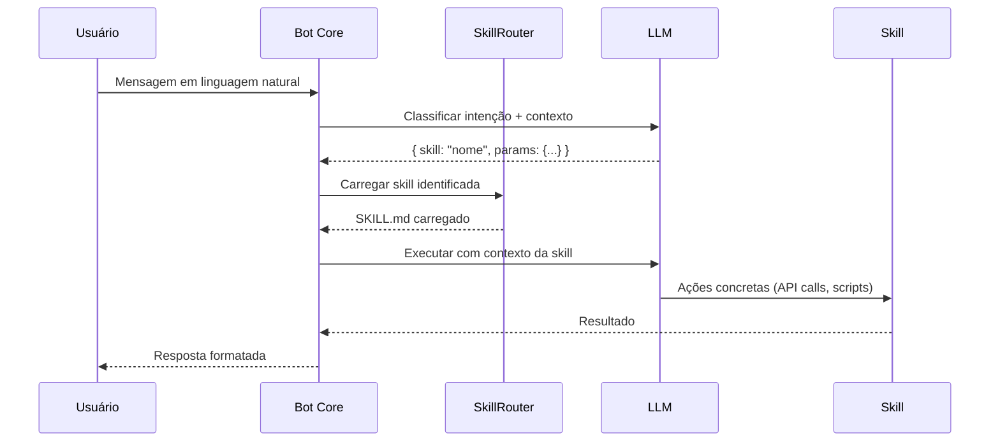

# Model Card: GueClaw Bot (Agente Principal)

## Descrição
Assistente pessoal de IA operado via Telegram que gerencia agenda, notas, WhatsApp, VPS e automações para Moises — ativando skills especializadas conforme a intenção da mensagem.

## Capacidades

- Classificar intenções em linguagem natural e rotear para a skill correta
- Gerenciar eventos no Google Calendar (criar, listar, cancelar)
- Enviar e agendar mensagens via WhatsApp (UazAPI)
- Criar e buscar notas no vault Obsidian via GitHub
- Executar comandos e gerenciar serviços na VPS
- Conduzir campanhas de WhatsApp com leads (CSV → SQLite → disparo)
- Criar e melhorar suas próprias skills (self-improvement)
- Gerar relatórios e análises de dados

## Skills Disponíveis (2026-03-23)

| Skill | Domínio |
|---|---|
| google-calendar-daily | Agenda diária |
| google-calendar-events | Criar/gerenciar eventos |
| obsidian-notes | Notas e vault |
| uazapi-whatsapp | WhatsApp mensagens |
| uazapi-scheduler | Agendamento de mensagens |
| uazapi-groups | Grupos WhatsApp |
| whatsapp-leads-sender | Campanhas de leads |
| vps-manager | Administração VPS |
| self-improvement | Criar/melhorar skills |
| skill-creator | Engenharia de skills |
| project-docs | Documentação técnica |
| liquidacao-sentenca | Direito processual |
| matematica-financeira | Cálculos financeiros |
| rag-curriculos | Análise de currículos |
| frontend-design | UI/Frontend |
| skill-security-analyzer | Segurança de skills |
| subagent-creator | Criar subagentes |
| doe | Engenharia de software |

## Limitações

- Não toma decisões irreversíveis sem confirmação explícita do usuário
- Não armazena tokens/credenciais em memória conversacional
- Skills dependentes de API externa falham graciosamente se a API estiver indisponível
- Sem acesso a internet genérico (apenas APIs configuradas)
- Sem execução de código arbitrário fora de scripts pré-existentes

## Dependências

| Dependência | Tipo | Obrigatória? | Fallback |
|---|---|---|---|
| LLM Provider (Claude/GPT/Copilot) | Raciocínio | Sim | Trocar provider em config |
| Telegram Bot API | Canal IO | Sim | — |
| Google OAuth Token | Calendar | Não | Mensagem de erro |
| UazAPI Token | WhatsApp | Não | Mensagem de erro |
| GitHub PAT (vault sync) | Skills sync | Não | Sync manual |

## Restrições Éticas

- Não enviar mensagens WhatsApp em massa sem consentimento do destinatário
- Não acessar dados de terceiros sem consentimento explícito
- Não executar `rm -rf`, `git reset --hard`, deploys em produção sem confirmação
- Não expor variáveis `.env`, tokens ou credenciais em respostas

## Chain of Thought — Fluxo Principal

## Métricas de Performance

- Skills disponíveis: 18
- Última sincronização com vault: 2026-03-23
- Uptime (PM2): ver `pm2 status` na VPS

## Histórico de Versões

| Versão | Data | Mudança | Impacto |
|---|---|---|---|
| 1.0.0 | 2026-03-23 | Model Card inicial | — |
