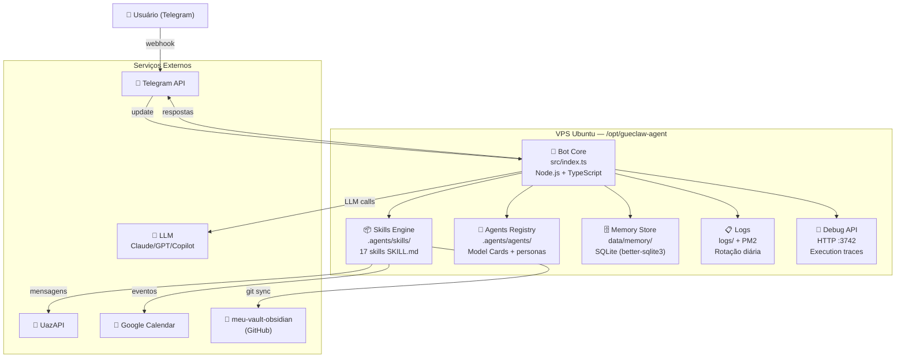

# Arquitetura — Nível 2: Containers (C4)

Decomposição do GueClaw Bot em processos e tecnologias.

## Diagrama C4 — Containers

## Containers em Detalhe

### Bot Core (`src/`)
| Arquivo/Dir | Responsabilidade |
|---|---|
| `src/index.ts` | Entry point, inicialização, webhook |
| `src/core/` | SkillRouter, MemoryManager, AgentLoop |
| `src/handlers/` | Handlers de mensagens Telegram |
| `src/services/` | Integrações externas (Calendar, WhatsApp) |
| `src/tools/` | Tools disponíveis para o LLM |
| `src/api/` | Debug API REST (:3742) |

### Skills Engine (`.agents/skills/`)
- Cada skill é um diretório com `SKILL.md` (instruções) + scripts opcionais
- Carregadas dinamicamente pelo SkillRouter
- Sincronizadas com `meu-vault-obsidian` via `scripts/sync-skills.sh`

### Memory Store (`data/`)
- `data/memory/` — memória conversacional por usuário
- `data/heartbeat/` — registro de saúde do sistema
- Banco SQLite local, sem dependências de cloud

### Logs (`logs/`)
- Logs de PM2 (stdout + stderr)
- Rotação automática diária
- Debug API expõe últimas entradas via HTTP

## Próximo nível
→ [Decisões de Arquitetura (ADR)](decisions/)
