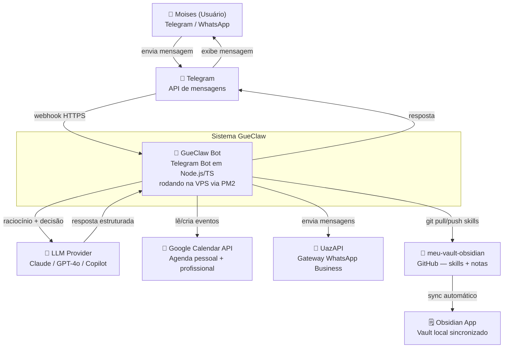

# Arquitetura — Nível 1: Contexto (C4)

Visão de alto nível do sistema GueClaw e como ele se relaciona com o mundo externo.

## Diagrama C4 — Contexto

## Descrição dos Atores e Sistemas

### Usuário (Moises)
- Interage exclusivamente via **Telegram** (texto e comandos)
- Pode também ser acionado via WhatsApp quando o bot dispara mensagens

### GueClaw Bot (sistema principal)
- Recebe mensagens via webhook Telegram
- Classifica a intenção e invoca a skill correta
- Delega raciocínio ao LLM provider configurado
- Executa ações nos sistemas externos via skills

### Sistemas externos

| Sistema | Papel | Protocolo |
|---|---|---|
| Telegram API | Canal de entrada/saída do usuário | HTTPS Webhook |
| LLM Provider | Raciocínio, classificação, geração | HTTPS REST |
| Google Calendar | Leitura e criação de eventos | OAuth2 + REST |
| UazAPI (WhatsApp) | Envio de mensagens e campanhas | HTTPS REST |
| meu-vault-obsidian | Repositório central de skills e notas | Git SSH/HTTPS |

## Próximo nível
→ [Arquitetura — Containers (C4)](c4-containers.md)
