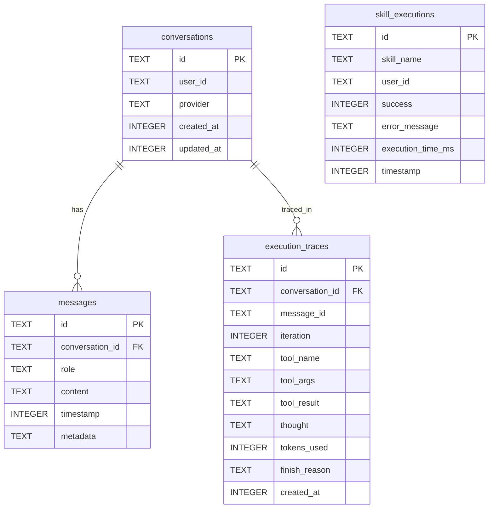

# Schema do Banco de Dados (SQLite)

**Arquivo:** `./data/gueclaw.db` (padrão) ou `DATABASE_PATH` no `.env`
**Gerado por:** `src/core/memory/database.ts` — `initializeSchema()`
**Mode WAL:** habilitado se `ENABLE_WAL=true` no `.env`

## Diagrama ER



## Tabelas em Detalhe

### `conversations`
Cada conversa é uma sessão entre o bot e um usuário. Uma conversa pode ter muitas mensagens.

| Coluna | Tipo | Descrição |
|---|---|---|
| `id` | TEXT PK | UUID da conversa |
| `user_id` | TEXT | ID do usuário no Telegram |
| `provider` | TEXT | Provider LLM usado (`github-copilot`, `deepseek`, etc.) |
| `created_at` | INTEGER | Unix timestamp de criação |
| `updated_at` | INTEGER | Unix timestamp da última mensagem |

### `messages`
Histórico de mensagens de uma conversa. Usado pelo MemoryManager para montar o context window do LLM.

| Coluna | Tipo | Descrição |
|---|---|---|
| `id` | TEXT PK | UUID da mensagem |
| `conversation_id` | TEXT FK | Referência à `conversations.id` |
| `role` | TEXT | `user`, `assistant`, `system` ou `tool` |
| `content` | TEXT | Conteúdo da mensagem |
| `timestamp` | INTEGER | Unix timestamp |
| `metadata` | TEXT | JSON opcional (ex: nome da skill usada) |

> **FK com CASCADE:** deletar uma conversa deleta todas as mensagens automaticamente.

### `skill_executions`
Log analítico de execuções de skills. Usado para métricas de performance e debug.

| Coluna | Tipo | Descrição |
|---|---|---|
| `id` | TEXT PK | UUID |
| `skill_name` | TEXT | Nome da skill (ex: `vps-manager`) |
| `user_id` | TEXT | Quem ativou a skill |
| `success` | INTEGER | `1` = sucesso, `0` = falha |
| `error_message` | TEXT | Mensagem de erro se `success=0` |
| `execution_time_ms` | INTEGER | Duração em milissegundos |
| `timestamp` | INTEGER | Unix timestamp |

### `execution_traces`
Rastreamento detalhado do ReAct loop para o Debug API (`http://localhost:3742`).

| Coluna | Tipo | Descrição |
|---|---|---|
| `id` | TEXT PK | UUID |
| `conversation_id` | TEXT FK | Conversa que gerou o trace |
| `message_id` | TEXT | Mensagem que disparou a iteração |
| `iteration` | INTEGER | Número da iteração do ReAct loop |
| `tool_name` | TEXT | Tool chamada (ou `null` se nenhuma) |
| `tool_args` | TEXT | JSON dos argumentos da tool |
| `tool_result` | TEXT | JSON do resultado da tool |
| `thought` | TEXT | Pensamento do LLM nessa iteração |
| `tokens_used` | INTEGER | Tokens consumidos na iteração |
| `finish_reason` | TEXT | `stop`, `tool_calls`, `error`, etc. |
| `created_at` | INTEGER | Unix timestamp |

## Índices

```sql
idx_messages_conversation  → messages(conversation_id, timestamp)
idx_conversations_user     → conversations(user_id, updated_at)
idx_skill_executions_user  → skill_executions(user_id, timestamp)
idx_traces_conversation    → execution_traces(conversation_id, created_at)
```

## Banco de Leads (separado)

A skill `whatsapp-leads-sender` usa um banco **separado** em:
`.agents/skills/whatsapp-leads-sender/data/leads.db`

Schema gerenciado pela própria skill (`scripts/db_manager.py`).

## Consultas úteis para debug

```bash
# Na VPS ou local: acessar o banco
sqlite3 ./data/gueclaw.db

# Últimas 10 conversas
SELECT id, user_id, provider, datetime(updated_at, 'unixepoch') as updated 
FROM conversations ORDER BY updated_at DESC LIMIT 10;

# Histórico de uma conversa
SELECT role, content, datetime(timestamp, 'unixepoch') as ts
FROM messages WHERE conversation_id = 'ID_AQUI' ORDER BY timestamp;

# Skills mais usadas
SELECT skill_name, COUNT(*) as total, 
       SUM(success) as sucessos,
       AVG(execution_time_ms) as tempo_medio
FROM skill_executions GROUP BY skill_name ORDER BY total DESC;

# Últimos erros
SELECT skill_name, error_message, datetime(timestamp, 'unixepoch') as ts
FROM skill_executions WHERE success=0 ORDER BY timestamp DESC LIMIT 20;
```
