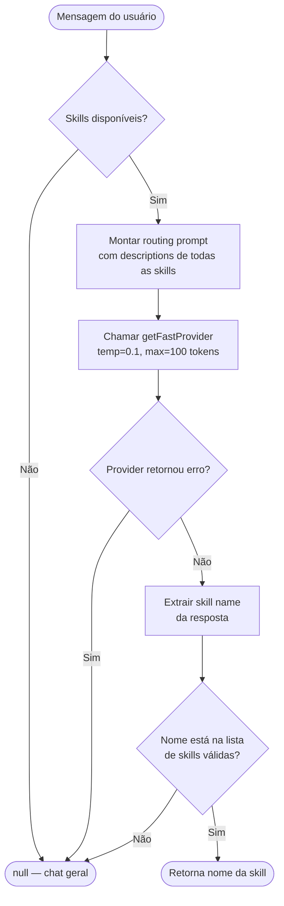

# Skill Routing — Como o Bot Decide Qual Skill Usar

## Visão Geral

O `SkillRouter` (`src/core/skills/skill-router.ts`) usa **um LLM com temperatura baixa** para classificar a intenção do usuário e mapear para uma skill. Não é baseado em regex, palavras-chave hardcoded ou embeddings — é um LLM especializado em roteamento.

## Algoritmo Passo a Passo



## O Prompt de Roteamento (código real)

```
You are a skill router. Your job is to determine which skill (if any) 
should handle the user's request.

Available skills:
- **nome-skill**: [description do SKILL.md]
...

Instructions:
1. Analyze the user's request carefully
2. If the request clearly matches one of the available skills, 
   respond with ONLY the skill name (e.g., "vps-manager")
3. If no skill is a good match, respond with "null"
4. Do NOT add explanations or extra text
5. Be precise: only route to a skill if there's a clear match

Respond with the skill name or "null":
```

**Parâmetros:**
- `temperature: 0.1` — determinístico, sem criatividade
- `maxTokens: 100` — resposta curta (só o nome)
- Provider: `getFastProvider()` — o mais barato/rápido disponível

## O que determina se uma skill é ativada

**A `description` no frontmatter do `SKILL.md`** é o único critério de matching. Exemplo:

```yaml
---
name: vps-manager
description: >
  Manage VPS operations including system administration, Docker containers,
  services, monitoring, and infrastructure tasks.
---
```

O LLM lê essa description e decide se a mensagem do usuário se encaixa.

### Boas práticas para descriptions eficazes

1. **Verbos de ação explícitos:** "Use when user asks to create, list, check, send..."
2. **Palavras-chave do domínio:** Inclua termos que o usuário pode usar
3. **Contexto negativo:** "Do NOT use for X" reduz falsos positivos
4. **Linguagem natural:** Escreva para o LLM, não para uma máquina

## Validação pós-LLM

O `parseRoutingResponse` só aceita a resposta se:
1. O valor extraído (`[\w-]+`) **existe na lista de skills carregadas**
2. O valor não é `"null"`, `"none"` ou vazio

Se o LLM retornar um nome que não existe (ex: erro formatado como texto), é **ignorado** e retorna `null`.

## Fallback Chain

```
Routing falha (provider error)  → null → chat geral
Routing retorna "null"          → null → chat geral  
Resultado inválido              → null → chat geral
```

Nunca lança exceção. Sempre degrada graciosamente para chat.

## Depois que a skill é identificada

O `SkillExecutor` / `AgentController` injeta o conteúdo do `SKILL.md` como **system prompt adicional** antes de chamar o LLM principal. O LLM então "sabe" exatamente como executar aquela skill.

## Implicações para criar skills

- **Descriptions vagas** → skill nunca é ativada (undertriggering)
- **Descriptions genéricas** → skill ativada quando não deveria (overtriggering)  
- **Regra:** Description deve ser "um pouco agressiva" — inclua variações coloquiais
  - ❌ `"Manage WhatsApp messages"`
  - ✅ `"Send WhatsApp messages. Use when user mentions 'WhatsApp', 'zap', 'mensagem no whats', 'wpp'..."`
