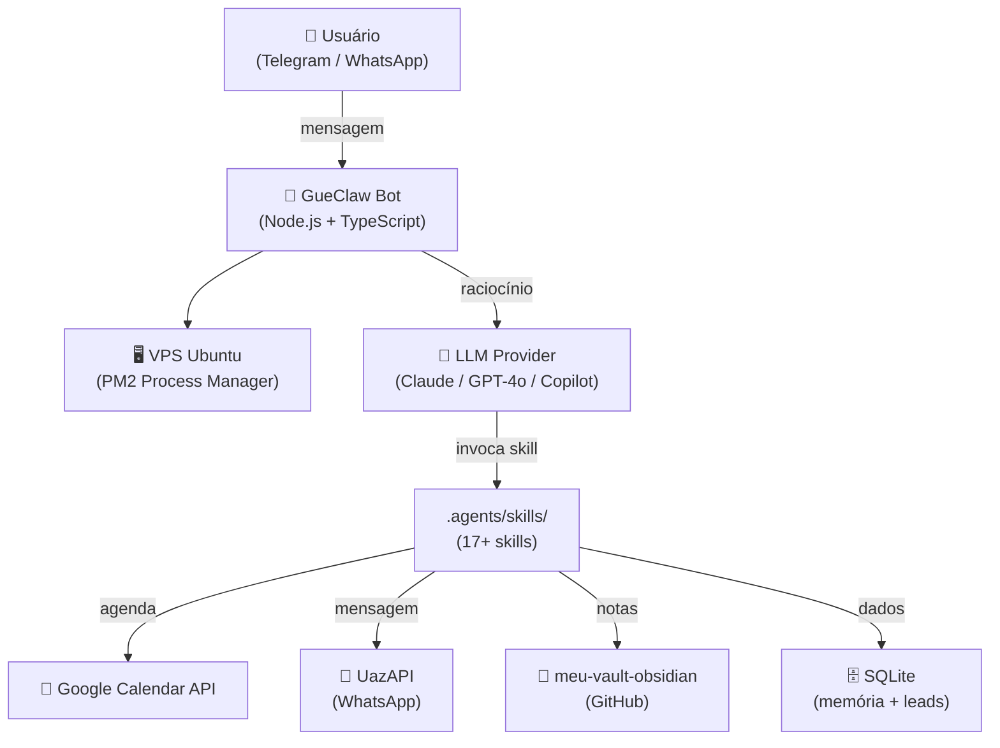

# GueClaw — Documentação Técnica

Plataforma de agentes de IA para automação pessoal e profissional via Telegram, WhatsApp e integrações com Google, Obsidian e VPS.

---

## Arquitetura em 30 segundos

## Navegação

| Seção | Conteúdo |
|---|---|
| [Arquitetura](architecture/c4-context.md) | Modelo C4, diagramas de containers e sequência |
| [Decisões (ADR)](architecture/decisions/) | Por que cada decisão técnica foi tomada |
| [Agentes](agents/) | Model Cards de cada agente do sistema |
| [Operações](operations/vps-history.md) | Histórico de deploys e mudanças na VPS |
| [Runbook](operations/runbook.md) | Como operar em produção |

## Stack

| Camada | Tecnologia |
|---|---|
| Runtime | Node.js 20 + TypeScript |
| Bot API | Telegram Bot API |
| WhatsApp | UazAPI |
| LLM | Claude 3.5 Sonnet / GPT-4o / GitHub Copilot |
| Banco | SQLite (better-sqlite3) |
| Deploy | PM2 em VPS Ubuntu |
| Vault | GitHub (meu-vault-obsidian) |
| CI/CD | GitHub Actions |

## Repositórios

| Repositório | Propósito |
|---|---|
| [gueclaw](https://github.com/Moisesjr20/gueclaw) | Código principal do bot |
| [meu-vault-obsidian](https://github.com/Moisesjr20/meu-vault-obsidian) | Skills, agents e notas Obsidian (fonte da verdade) |
